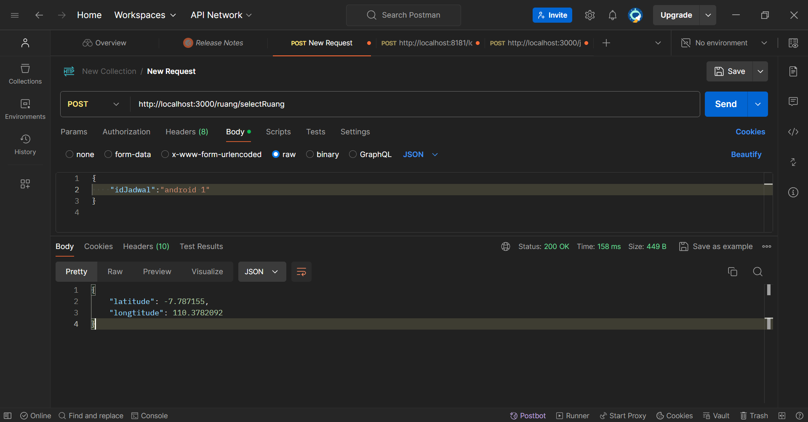

# Backend for MFA
Applikasi Backend untuk prototipe MFA
## Features
- Manajemen kelas : CRUD data kelas
- Manajemen presensi : CRUD data presensi
## Articles

## How to start
Jalankan perintah melalui console pada directory project  
```
npm install
```

lalu jalankan perintah 
```
npm run serve
```
Akses API yang ada pada daftar endpoint melalui aplikasi Postman  

## API Endpoint List
### Manajemen kelas
- GET localhost:3000/kelas/  
- POST localhost:3000/kelas/  
Request Body
```
    {
        "kode_matakuliah": 556565, //requried numeric
        "group_kelas": "XZ", //required string
        "kode_semester": 7, //required numeric int
        "kode_dosen": 123 //required numeric int
    }
```
- PATCH localhost:3000/kelas/{id}  
Request Body
```
    {
        "group_kelas": "XZ", //required string
        "kode_semester": 7, //required numeric int
        "kode_dosen": 123 //required numeric int
    }
```
- DELETE localhost:3000/kelas/{id}

### Manajemen Jadwal
- GET http://localhost:3000/jadwal
- POST http://localhost:3000/jadwal
Request Body for post
```
    {
                "group_kelas": "B",
                "kode_kelas": 15,
                "tanggal": "2024-05-09",
                "kode_jadwal": "PROGWEB 1",
                "kode_sesi": "1",
                "kode_ruang": "D.3.2",
                "sesi_start": "07:30",
                "sesi_end": "10:20",
                "nama_matakuliah": "Matematika Teknik"
            }
```
- PATCH http://localhost:3000/jadwalKuliah/{kode_jadwal}
```
{
"kode_jadwal": "tes aja",
"kode_ruang": "kode_ruang_baru",
"kode_sesi": "kode_sesi_baru",
"tanggal": "2024-04-24 08:00:00",
"kode_kelas": "5"
}
```
- DELETE http://localhost:3000/jadwal/{kode_jadwal}


### Manajemen kelas_sesi
- GET http://localhost:3000/sesi

### get profil user
- POST http://localhost:3000/daftarpresensi/getProfile/email
```
{
    "email": "yoannes.haryo@gmail.com"
}
```


### Manajemen Mata Kuliah
- GET http://localhost:3000/mataKuliah
- POST http://localhost:3000/mataKuliah
- Request Body for Mata Kuliah
```
{
"kode_matakuliah": 6969,
"nama_matakuliah": "testing",
"sks": 3,
"harga": 8888888,
"is_praktikum": 0,
"minimal_sks": 50,
"tanggal_input": "2024-05-04"
}
```
- PATCH http://localhost:3000/mataKuliah/{kode_matakuliah}
Request Body for patch kode matakuliah
```
{
"kode_matakuliah": 2121,
"nama_matakuliah": "android",
"sks": 3,
"harga": 150000,
"is_praktikum": 0,
"minimal_sks": 50,
"tanggal_input": "2024-05-04"
}
```
- DELETE http://localhost:3000/mataKuliah/{kode_matakuliah}

### Manajemen RUANG
- GET http://localhost:3000/ruang
- POST http://localhost:3000/ruang
Request Body
```
{
"kodeRuang": "D.3.1",
"nama": "Didaktos 1",
"latitude": "",
"longitude": ""
}
```
- PATCH http://localhost:3000/ruang/{kode_ruang}
Request Body
```
{
"kodeRuang": "D.3.1",
"nama": "Didaktos 1",
"latitude": 1,
"longitude": 1
}
```
- DELETE http://localhost:3000/ruang/{kode_ruang}

- get latitute longtitude


### Manajemen Semester
- GET http://localhost:3000/semester
- POST http://localhost:3000/semester
Request Body
```
{
"kode_semester": 5,
"tahun_ajaran": "2024/2025",
"tanggal_mulai": "2024-08-01",
"tanggal_selesai": "2024-12-20"
}
```
- PATCH http://localhost:3000/semester/{kode_semester}
```
{
"kode_semester": 5,
"tahun_ajaran": "2024/2025",
"tanggal_mulai": "2024-08-01",
"tanggal_selesai": "2024-12-20"
}
```
- DELETE http://localhost:3000/semester/{kode_semester}

### Manajemen Dosen
- GET http://localhost:3000/dosen
- POST http://localhost:3000/dosen
Request Body
```
{
"nidn": "80600707",
"kode_prodi": "7",
"nama": "Hendro"
}
```
### Manajemen Mahasiswa
- GET http://localhost:3000/users
- POST http://localhost:3000/users
Request Body
```
{
"nim": "71210713",
"kode_prodi": "71",
"tahun_angkatan": 2021,
"nama": "Aryo"
}
```
- PATCH http://localhost:3000/users/{nim}
Request Body
```
{
"nim": "71210713",
"kode_prodi": "71",
"tahun_angkatan": 2021,
"nama": "Aryo"
}
```
- DELETE http://localhost:3000/users/{nim}

### Manajemen presensi
- GET localhost:3000/presensi/  
- POST localhost:3000/presensi/ 
Request Body
```
           {
                "id_presensi": 3,
                "jadwal": "jemuah kliwon",
                "nim_mahasiswa": "7121",
                "hadir": 0
            }
```
- PATCH localhost:3000/presensi/{id}  
Request Body
```
{
    "jadwal":"rabu",
    "nim_mahasiswa":"7121",
    "hadir":0
}
```
- DELETE localhost:3000/presensi/{id}
## Tools
- Node.JS  
- Express JS 


## cara testing qr
- endpoint: http://localhost:3000/presensi/kode_jadwal
example:
```
[
{
"data": "android 1 5/13/2024, 10:16:48 PM"
},
{
"data": "android 1 5/13/2024, 10:21:48 PM"
},
{
"user": "Aryo"
}
]
```

## untuk menambahkan mahasiswa di setiap kelasnya:
- insert di db dan pastikan kode_jadwal sama dengan kode jadwal yang ada pada table jadwal
